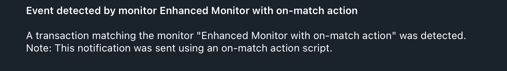

# 10. On-Match Action Script

This example demonstrates how to use an `on_match` action to execute a JavaScript script when a monitor is triggered. The script can modify the `MonitorMatch` object before it is sent to notifiers.

### Configuration Files

- [`app.yaml`](../../docs/src/user_guide/config_app.md): Basic application configuration, pointing to public RPC endpoints.
- [`monitors.yaml`](../../docs/src/user_guide/config_monitors.md): Defines the "Large ETH Transfers (on-match)" monitor and an `on_match` action.
- [`notifiers.yaml`](../../docs/src/user_guide/config_notifiers.md): Defines "Telegram Notifier (on-match)".
- `actions.yaml`: Defines the action that runs the script.
- `action.js`: The JavaScript code that modifies the match data.

### Monitor Configuration

The `monitors.yaml` file defines a monitor that triggers on large ETH transfers and executes a script on each match.

```yaml
monitors:
  - name: "Large ETH Transfers (on-match)"
    network: "ethereum"
    filter_script: |
      tx.value > ether(10)
    notifiers:
      - "Telegram Notifier (on-match)"
    on_match:
      - "Test action"
```

- **`on_match`**: A list of action names (defined in `actions.yaml`) that will be executed when this monitor triggers. The scripts are executed sequentially.

### Action Configuration

The `actions.yaml` file maps action names to script files.

```yaml
actions:
  - name: Test action
    file: "examples/10_on_match_script/action.js"
```

- **`name`**: A unique name for the action, referenced in `monitors.yaml`.
- **`file`**: The path to the script file to execute.

### Action Script (`action.js`)

The JavaScript file has access to a global `context` object, which it can modify.

```javascript
// Example action that modifies the context object
console.log("=== Action Triggered ===");
console.log("Monitor:", context.monitor_name);
console.log("Block Number:", context.block_number);

// Modify existing fields only (can't add new fields to strongly-typed struct)
context.monitor_name = "Enhanced " + context.monitor_name;

console.log("Modified monitor name:", context.monitor_name);
console.log("========================");
```

In this example, the script logs the original monitor name and block number, then prepends `"Enhanced "` to the `monitor_name`. This modified name will be used in notifications.

### How to Run ([Dry-Run Mode](../../docs/src/operations/cli.md#dry-run-mode))

To test this monitor against historical blocks, use the `dry-run` command with the `--config-dir` argument pointing to this example's configuration:

```bash
cargo run --release -- dry-run --from 23159299 --to 23159299 --config-dir examples/10_on_match_script/
```

Run with `debug` logs:

```bash
RUST_LOG=debug cargo run --release -- dry-run --from 23159299 --to 23159299 --config-dir examples/10_on_match_script/
```

Run with Docker image from GHCR:

```bash
docker run --rm \
  --env-file .env \
  -v "$(pwd)/examples/10_on_match_script:/app/configs:ro" \
  -v "$(pwd)/abis:/app/abis:ro" \
  ghcr.io/isserge/argus-rs:latest \
  dry-run --from 23159299 --to 23159299 --config-dir /app/configs
```

### Expected Output

As blocks are processed, you will see the output from the `action.js` script in your terminal (with `debug` logs):

```
=== Action Triggered ===
Monitor: Large ETH Transfers (on-match)
Block Number: 23159299
Modified monitor name: Enhanced Large ETH Transfers (on-match)
========================
```

The notification sent to Telegram will use the modified monitor name:



The final JSON output from the `dry-run` will also reflect the modified data:

```json
[
  {
    "monitor_id": 0,
    "monitor_name": "Monitor with on-match action",
    "notifier_name": "Monitor with on-match action",
    "block_number": 23159299,
    "transaction_hash": "0x205e6fa87be0a87842a173ca3cb8188162c20331d4758cbebcd47dabb3f38175",
    "tx": {
      "from": "0xa1abfA21f80ecf401bd41365adBb6fEF6fEfDF09",
      "gas_limit": 90000,
      "hash": "0x205e6fa87be0a87842a173ca3cb8188162c20331d4758cbebcd47dabb3f38175",
      "input": "0x",
      "max_fee_per_gas": "200000000000",
      "max_priority_fee_per_gas": "2000000000",
      "nonce": 63008,
      "to": "0x712FDCbCDfacb91E2216CA850C066C3BFB76710F",
      "transaction_index": 82,
      "value": "150999500000000000000"
    }
  },
  // 2 more items
]
```

### How to Run (Default Mode)

Once you have verified your monitor works, you can start it in live monitoring mode.

```bash
car go run --release -- run --config-dir examples/10_on_match_script/
```

Using Docker image from GHCR:

```bash
# First, create a data directory for this example
mkdir -p examples/10_on_match_script/data

# Run the container in detached mode
docker run --rm -d \
  --name argus_example_10 \
  --env-file .env \
  -v "$(pwd)/examples/10_on_match_script:/app/configs:ro" \
  -v "$(pwd)/abis:/app/abis:ro" \
  -v "$(pwd)/examples/10_on_match_script/data:/app/data" \
  ghcr.io/isserge/argus-rs:latest \
  run --config-dir /app/configs
```
