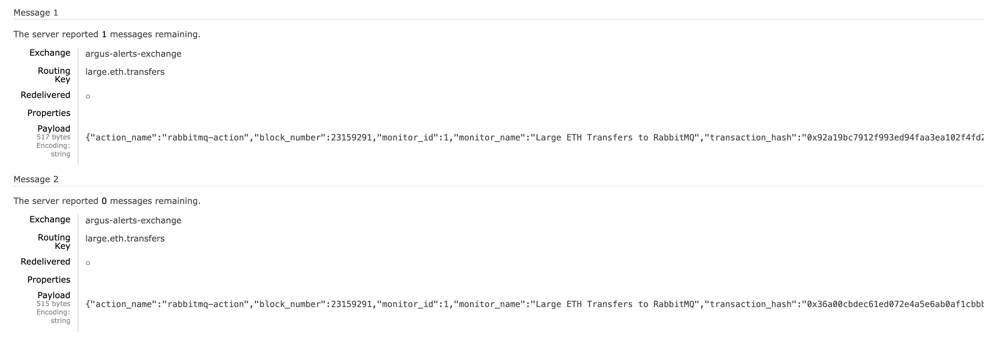

# 11. Action with RabbitMQ Publisher

This example demonstrates how to configure and use a `rabbitmq` action to send
notifications to a RabbitMQ exchange. It includes a `docker-compose.yml` to easily
spin up a local RabbitMQ broker for testing.

### Configuration Files

- [`docker-compose.yml`](./docker-compose.yml): A minimal setup to run a single-node RabbitMQ broker locally using the lightweight, multi-arch `rabbitmq:3-management-alpine` image.
- [`app.yaml`](../../docs/src/user_guide/config_app.md): Basic application configuration.
- [`monitors.yaml`](../../docs/src/user_guide/config_monitors.md): Defines the "Large ETH Transfers to RabbitMQ" monitor.
- [`actions.yaml`](../../docs/src/user_guide/config_actions.md): Defines a `rabbitmq` action that sends notifications to a local RabbitMQ broker.

### Prerequisites

- [Docker](https://www.docker.com/get-started) and [Docker Compose](https://docs.docker.com/compose/install/) installed.

### How to Run

#### 1. Start RabbitMQ Broker

First, start the RabbitMQ broker using the provided `docker-compose.yml`:

```bash
docker compose -f examples/11_action_with_rabbitmq_publisher/docker-compose.yml up -d
```

This will start a RabbitMQ broker in detached mode, with the AMQP protocol listening on `localhost:5672` and the management UI on `http://localhost:15672`.

#### 2. Run the Monitor (Dry-Run Mode)

To test this monitor against historical blocks, use the `dry-run` command:

```bash
cargo run --release -- dry-run --from 23159290 --to 23159291 --config-dir examples/11_action_with_rabbitmq_publisher/
```

Run with `debug` logs:

```bash
RUST_LOG=debug cargo run --release -- dry-run --from 23159290 --to 23159291 --config-dir examples/11_action_with_rabbitmq_publisher/
```

#### 3. Verify the Output in RabbitMQ

While the `dry-run` is in progress or after it has finished, you can check the messages in the RabbitMQ management UI.

1.  Open your web browser and navigate to `http://localhost:15672`.
2.  Log in with the default credentials: `guest` / `guest`.
3.  Go to the **Exchanges** tab and click on the `argus-alerts-exchange` exchange.
4.  To see the messages, you need to bind a queue to the exchange. Under the **Bindings** section, create a new binding:
    -   **To queue**: `my-test-queue` (you can choose any name)
    -   **Routing key**: `large.eth.transfers` (must match the one in `actions.yaml`)
    -   Click **Bind**.
5.  Now, re-run the `dry-run` command.
6.  Go to the **Queues** tab, and you should see `my-test-queue` with messages in it. Click on the queue name, and under the **Get messages** section, you can inspect the message payloads.



#### 4. Stop and Clean Up

Once you are finished, you can stop and remove the RabbitMQ container:

```bash
docker compose -f examples/11_action_with_rabbitmq_publisher/docker-compose.yml down
```
