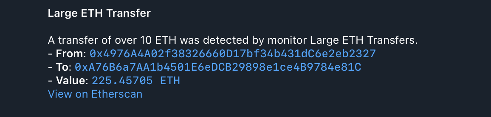

# 1. Basic ETH Transfer Monitor

This example sets up a monitor that triggers when a transaction with a value greater than 10 ETH is detected on the Ethereum mainnet. It uses a basic Telegram notifier.

### Configuration Files

- `app.yaml`: Basic application configuration, pointing to public RPC endpoints.
- `monitors.yaml`: Defines the "Large ETH Transfers" monitor.
- `notifiers.yaml`: Defines "Telegram Large ETH Transfers" notifier.

### Monitor Configuration

The `monitors.yaml` file in this example defines a single monitor:

```yaml
monitors:
  - name: "Large ETH Transfers"
    network: "ethereum"
    filter_script: |
      tx.value > ether(10)
    notifiers:
      - "Telegram Large ETH Transfers"
```

- **`name`**: A human-readable name for the monitor.
- **`network`**: Specifies the blockchain network to monitor (e.g., "ethereum"). This must match a network configured in `app.yaml`.
- **`filter_script`**: This is a Rhai script that defines the conditions under which the monitor will trigger. In this example, `tx.value > ether(10)` checks if the transaction's value is greater than 10 ETH. The `ether()` function is a convenient wrapper, which handles `BigInt` conversions.
- **`notifiers`**: A list of notifier names (defined in `notifiers.yaml`) that will receive alerts when this monitor triggers. Here, it references "Telegram Large ETH Transfers".

### Notifier Configuration

The `notifiers.yaml` in this example defines a single Telegram notifier:

```yaml
notifiers:
  - name: "Telegram Large ETH Transfers"
    telegram:
      token: "<TELEGRAM TOKEN>"
      chat_id: "<TELEGRAM CHAT ID>"
      disable_web_preview: true
      message:
        title: "Large ETH Transfer"
        body: |
          A transfer of over 10 ETH was detected by monitor {{ monitor_name }}.
          - *From*: `{{ from }}`
          - *To*: `{{ to }}`
          - *Value*: `{{ value }}` (in raw decimals)
          [View on Etherscan](https://etherscan.io/tx/{{ transaction_hash }})
```

-   **`name`**: A unique, human-readable name for the notifier. This name is referenced by monitors in their `notifiers` list.
-   **`telegram`**: This block configures a Telegram notifier.
    -   **`token`**: Your Telegram bot token.
    -   **`chat_id`**: The ID of the Telegram chat where notifications will be sent.
    -   **`disable_web_preview`**: (Optional) Set to `true` to disable link previews in Telegram messages.
    -   **`message`**: Defines the structure and content of the notification message.
        -   **`title`**: The title of the notification. Supports [Jinja2-like templating](https://docs.rs/minijinja/latest/minijinja/) to include dynamic data from the monitor match (e.g., `{{ monitor_name }}`).
        -   **`body`**: The main content of the notification. Supports [Jinja2-like templating](https://docs.rs/minijinja/latest/minijinja/) and Markdown formatting.

### How to Run (Dry-Run Mode)

To test this monitor against historical blocks, use the `dry-run` command with the `--config-dir` argument pointing to this example's configuration:

```bash
cargo run --release -- dry-run --from 23159290 --to 23159300 --config-dir examples/1_basic_eth_transfer/
```

Run with `debug` logs:

```bash
RUST_LOG=debug cargo run --release -- dry-run --from 23159290 --to 23159300 --config-dir examples/1_basic_eth_transfer/
```

Replace `23159290` and `23159300` with any Ethereum block numbers to test against.

#### Expected Output

As blocks within the specified range are processed, you should receive notifications on Telegram (or another specified notifier):



After `dry-run` processing is complete, you should see the following output in your terminal, which is a JSON array with all detected monitor matches:

```json
[
  {
    "monitor_id": 0,
    "monitor_name": "Large ETH Transfers",
    "notifier_name": "Telegram Large ETH Transfers",
    "block_number": 23159291,
    "transaction_hash": "0x92a19bc7912f993ed94faa3ea102f4fd244aaf78f5439071bd1126ab419f2ce6",
    "type": "transaction",
    "from": "0x30F2864e7bf6E89a3955217C78c8689594228940",
    "gas_limit": 21000,
    "gas_price": "2000000000",
    "hash": "0x92a19bc7912f993ed94faa3ea102f4fd244aaf78f5439071bd1126ab419f2ce6",
    "input": "0x",
    "nonce": 5361,
    "to": "0xCFFAd3200574698b78f32232aa9D63eABD290703",
    "transaction_index": 46,
    "value": "13859958000000000000"
  },
  /// 12 more items
]
```

### How to Run (Default Mode)

Once you have verified your monitor works against historical data in `dry-run` mode, you can start it in default (live monitoring) mode. In this mode, the monitor will continuously poll for new blocks and dispatch actual notifications via the configured notifier when a match is found.

```bash
cargo run --release -- run --config-dir examples/1_basic_eth_transfer/
```
