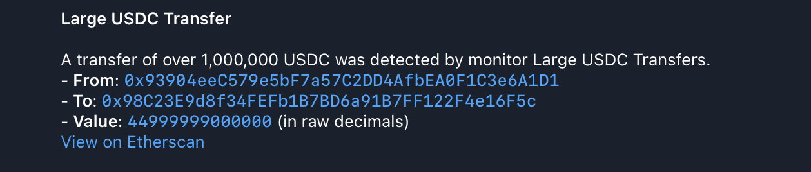

# 2. Large USDC Transfer Monitor

This example sets up a monitor that triggers when a `Transfer` event with a
value greater than 1,000,000 USDC is detected from the USDC contract on the
Ethereum mainnet. It uses a Telegram notifier.

### Configuration Files

- [`app.yaml`](../../docs/src/user_guide/config_app.md): Basic application configuration, pointing to public RPC endpoints.
- [`monitors.yaml`](../../docs/src/user_guide/config_monitors.md): Defines the "Large USDC Transfers" monitor.
- [`notifiers.yaml`](../../docs/src/user_guide/config_notifiers.md): Defines "Telegram Large USDC Transfers" notifier.

### Environment Variables for Notifier Secrets

> **Important:** All secrets and sensitive values in `notifiers.yaml` (such as API tokens, webhook URLs, chat IDs, etc.) must be provided as environment variables.
> For example, if your `notifiers.yaml` contains:
>
> ```yaml
> token: "${TELEGRAM_TOKEN}"
> chat_id: "${TELEGRAM_CHAT_ID}"
> ```
>
> You must set these in your shell before running Argus:
>
> ```sh
> export TELEGRAM_TOKEN="your-telegram-token"
> export TELEGRAM_CHAT_ID="your-chat-id"
> ```
>
> See the example `notifiers.yaml` for all required variables for each notifier type.

### Monitor Configuration

The `monitors.yaml` file in this example defines a single monitor. For a complete reference on monitor configuration, see the [Monitor Configuration documentation](../../docs/src/user_guide/config_monitors.md).

```yaml
monitors:
  - name: 'Large USDC Transfers'
    network: 'ethereum'
    address: '0xA0b86991c6218b36c1d19D4a2e9Eb0cE3606eB48'
    abi: 'usdc'
    filter_script: |
      log.name == "Transfer" && log.params.value > usdc(1_000_000)
    notifiers:
      - 'Telegram Large USDC Transfers'
```

- **`name`**: A human-readable name for the monitor.
- **`network`**: Specifies the blockchain network to monitor (e.g., "ethereum").
  This must match a network configured in `app.yaml`.
- **`address`**: The contract address of the USDC token on Ethereum mainnet.
  This ensures the monitor only processes events from this specific contract. For more details on `address` configuration, see the [Monitor Configuration documentation](../../docs/src/user_guide/config_monitors.md#monitor-fields).
- **`abi`**: The name of the ABI (Application Binary Interface) to use for
  decoding contract events. Here, "usdc" refers to the `usdc.json` file in the
  `abis/` directory. This is crucial for `log.name` and `log.params` to be
  available in the `filter_script`. For more details, see [ABI Management](../../docs/src/user_guide/config_abis.md).
- **`filter_script`**: This [Rhai script](../../docs/src/user_guide/rhai_scripts.md) defines the conditions for a match.
  `log.name == "Transfer"` checks for the `Transfer` event, and
  `log.params.value > usdc(1_000_000)` checks if the `value` parameter of that
  event is greater than 1 million USDC. The [`usdc()`](../../docs/src/user_guide/rhai_helpers.md#usdcvalue) function is a convenient
  wrapper for handling USDC denominations. For more on `log` data, see [Rhai Data Context](../../docs/src/user_guide/rhai_context.md#the-log-object-decoded-event-log).
- **`notifiers`**: A list of notifier names (defined in `notifiers.yaml`) that
  will receive alerts when this monitor triggers. Here, it references "Telegram
  Large USDC Transfers".

### Notifier Configuration

The `notifiers.yaml` in this example defines a single Telegram notifier. For a complete reference on notifier configuration, see the [Notifier Configuration documentation](../../docs/src/user_guide/config_notifiers.md).

```yaml
notifiers:
  - name: 'Telegram Large USDC Transfers'
    telegram:
      token: '<TELEGRAM TOKEN>'
      chat_id: '<TELEGRAM CHAT ID>'
      disable_web_preview: true
      message:
        title: 'Large USDC Transfer'
        body: |
          A transfer of over 1,000,000 USDC was detected by monitor {{ monitor_name }}.
          - *From*: `{{ log.params.from }}`
          - *To*: `{{ log.params.to }}`
          - *Value*: `{{ log.params.value | usdc }}` USDC
          [View on Etherscan](https://etherscan.io/tx/{{ transaction_hash }})
```

- **`name`**: A unique, human-readable name for the notifier. This name is
  referenced by monitors in their `notifiers` list.
- **`telegram`**: This block configures a Telegram notifier.
  - **`token`**: Your Telegram bot token.
  - **`chat_id`**: The ID of the Telegram chat where notifications will be sent.
  - **`disable_web_preview`**: (Optional) Set to `true` to disable link previews
    in Telegram messages.
  - **`message`**: Defines the structure and content of the notification
    message. For more details on templating, see the [Notifier Templating documentation](../../docs/src/user_guide/notifier_templating.md).
    - **`title`**: The title of the notification. Supports
      [Jinja2-like templating](https://docs.rs/minijinja/latest/minijinja/) to
      include dynamic data from the monitor match (e.g., `{{ monitor_name }}`).
    - **`body`**: The main content of the notification. Supports
      [Jinja2-like templating](https://docs.rs/minijinja/latest/minijinja/) and
      Markdown formatting.

### How to Run ([Dry-Run Mode](../../docs/src/operations/cli.md#dry-run-mode))

To test this monitor against historical blocks, use the `dry-run` command with
the `--config-dir` argument pointing to this example's configuration:

```bash
cargo run --release -- dry-run --from 23159290 --to 23159300 --config-dir examples/2_large_usdc_transfer/
```

Run with `debug` logs:

```bash
RUST_LOG=debug cargo run --release -- dry-run --from 23159290 --to 23159300 --config-dir examples/2_large_usdc_transfer/
```

Replace `23159290` and `23159300` with any Ethereum block numbers to test
against.

#### Expected Output

As blocks within the specified range are processed, you should receive
notifications on Telegram (or another specified notifier):



Once processing is complete, you should see the following output in your
terminal, which is a JSON array with all detected monitor matches:

```json
[
  {
    "monitor_id": 0,
    "monitor_name": "Large USDC Transfers",
    "notifier_name": "Telegram Large USDC Transfers",
    "block_number": 23159292,
    "transaction_hash": "0x583af129ea78623a363d8b0f582f220a14713ba4717771e30ec4408239991d0f",
    "type": "log",
    "contract_address": "0xa0b86991c6218b36c1d19d4a2e9eb0ce3606eb48",
    "log_index": 378,
    "log_name": "Transfer",
    "from": "0xEae7380dD4CeF6fbD1144F49E4D1e6964258A4F4",
    "to": "0xEe7aE85f2Fe2239E27D9c1E23fFFe168D63b4055",
    "value": 18616650000000
  }
  // 2 more items
]
```

### How to Run (Default Mode)

Once you have verified your monitor works against historical data in `dry-run`
mode, you can start it in default (live monitoring) mode. In this mode, the
monitor will continuously poll for new blocks and dispatch actual notifications
via the configured Telegram notifier when a match is found.

```bash
cargo run --release -- run --config-dir examples/2_large_usdc_transfer/
```
