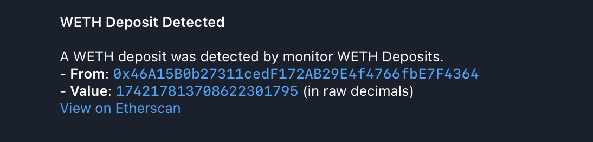

# 3. WETH Deposit Monitor

This example sets up a monitor that triggers when a `Deposit` event is detected
from the WETH contract on the Ethereum mainnet. It uses a Telegram notifier.

### Configuration Files

- `app.yaml`: Basic application configuration, pointing to public RPC endpoints.
- `monitors.yaml`: Defines the "WETH Deposits" monitor.
- `notifiers.yaml`: Defines "Telegram WETH Deposits" notifier.

### Monitor Configuration

The `monitors.yaml` file in this example defines a single monitor:

```yaml
monitors:
  - name: 'WETH Deposits'
    network: 'ethereum'
    address: '0xc02aaa39b223fe8d0a0e5c4f27ead9083c756cc2'
    abi: 'weth'
    filter_script: |
      log.name == "Deposit" && tx.value > ether(5)
    notifiers:
      - 'Telegram WETH Deposits'
```

- **`name`**: A human-readable name for the monitor.
- **`network`**: Specifies the blockchain network to monitor (e.g., "ethereum").
  This must match a network configured in `app.yaml`.
- **`address`**: The contract address of the WETH token on Ethereum mainnet.
  This ensures the monitor only processes events from this specific contract.
- **`abi`**: The name of the ABI (Application Binary Interface) to use for
  decoding contract events. Here, "weth" refers to the `weth.json` file in the
  `abis/` directory. This is crucial for `log.name` and `log.params` to be
  available in the `filter_script`.
- **`filter_script`**: This Rhai script defines the conditions for a match.
  `log.name == "Deposit"` checks for the `Deposit` event, `tx.value > ether(5)`
  checks if the transaction's value is greater than 5 ETH. The `ether()`
  function is a convenient wrapper, which handles `BigInt` conversions.
- **`notifiers`**: A list of notifier names (defined in `notifiers.yaml`) that
  will receive alerts when this monitor triggers. Here, it references "Telegram
  WETH Deposits".

### Notifier Configuration

The `notifiers.yaml` in this example defines a single Telegram notifier:

```yaml
notifiers:
  - name: 'Telegram WETH Deposits'
    telegram:
      token: '<TELEGRAM TOKEN>'
      chat_id: '<TELEGRAM CHAT ID>'
      disable_web_preview: true
      message:
        title: 'WETH Deposit Detected'
        body: |
          A WETH deposit was detected by monitor {{ monitor_name }}.
          - *From*: `{{ dst }}`                     
          - *Value*: `{{ wad }}` (in raw decimals) 
          [View on Etherscan](https://etherscan.io/tx/{{ transaction_hash }})
```

- **`name`**: A unique, human-readable name for the notifier. This name is
  referenced by monitors in their `notifiers` list.
- **`telegram`**: This block configures a Telegram notifier.
  - **`token`**: Your Telegram bot token.
  - **`chat_id`**: The ID of the Telegram chat where notifications will be sent.
  - **`disable_web_preview`**: (Optional) Set to `true` to disable link previews
    in Telegram messages.
  - **`message`**: Defines the structure and content of the notification
    message.
    - **`title`**: The title of the notification. Supports
      [Jinja2-like templating](https://docs.rs/minijinja/latest/minijinja/) to
      include dynamic data from the monitor match (e.g., `{{ monitor_name }}`).
    - **`body`**: The main content of the notification. In this example we use
      event log fields `dst` (the address that initiated the deposit) and `wad`
      (the amount of WETH deposited).

### How to Run (Dry-Run Mode)

To test this monitor against historical blocks, use the `dry-run` command with
the `--config-dir` argument pointing to this example's configuration:

```bash
cargo run --release -- dry-run --from 18000000 --to 18000010 --config-dir examples/3_weth_deposit/
```

Run with `debug` logs:

```bash
RUST_LOG=debug cargo run --release -- dry-run --from 18000000 --to 18000010 --config-dir examples/3_weth_deposit/
```

Replace `18000000` and `18000010` with any Ethereum block numbers to test
against.

#### Expected Output

As blocks within the specified range are processed, you should receive
notifications on Telegram (or another specified notifier):



Once processing is complete, you should see the following output in your
terminal, which is a JSON array with all detected monitor matches:

```json
[
  {
    "monitor_id": 0,
    "monitor_name": "WETH Deposits",
    "notifier_name": "Telegram WETH Deposits",
    "block_number": 18000004,
    "transaction_hash": "0xf180607da1c35e13bdb91ac8006337774812c34075ed1cdd9a7765f5197b4882",
    "type": "log",
    "contract_address": "0xc02aaa39b223fe8d0a0e5c4f27ead9083c756cc2",
    "log_index": 3,
    "log_name": "Deposit",
    "dst": "0x3fC91A3afd70395Cd496C647d5a6CC9D4B2b7FAD",
    "wad": 7000000000000000000
  }
  // 3 more items
]
```

### How to Run (Default Mode)

Once you have verified your monitor works against historical data in `dry-run`
mode, you can start it in default (live monitoring) mode. In this mode, the
monitor will continuously poll for new blocks and dispatch actual notifications
via the configured notifier when a match is found.

```bash
cargo run --release -- run --config-dir examples/3_weth_deposit/
```
