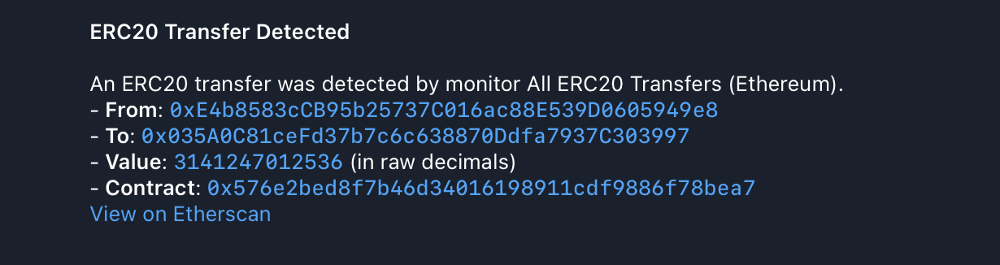

# 4. All ERC20 Transfers Monitor For A Specific EOA

This example sets up a global log monitor that triggers for any `Transfer` event from any ERC20-compliant contract on the Ethereum mainnet involving specific EOA. It uses a Telegram notifier.

### Configuration Files

- `app.yaml`: Basic application configuration, pointing to public RPC endpoints.
- `monitors.yaml`: Defines the "All ERC20 Transfers (Ethereum)" monitor.
- `notifiers.yaml`: Defines "Telegram ERC20 Transfers" notifier.

### Monitor Configuration

The `monitors.yaml` file in this example defines a single monitor:

```yaml
monitors:
  - name: 'All ERC20 Transfers (Ethereum)'
    network: 'ethereum'
    # Monitor all logs on the network
    address: 'all' 
    # The ABI should be a generic one that matches the event you're looking for.
    # For example, a standard ERC20 ABI can decode "Transfer" events from any
    # ERC20-compliant token contract.
    abi: 'usdc'
    # Filter for all Transfer events involving a specific address
    filter_script: |
      log.name == "Transfer" 
      && log.params.to == "0xE4b8583cCB95b25737C016ac88E539D0605949e8" 
      || log.params.from == "0xE4b8583cCB95b25737C016ac88E539D0605949e8"
    notifiers:
      - 'Telegram ERC20 Transfers'
```

- **`name`**: A human-readable name for the monitor.
- **`network`**: Specifies the blockchain network to monitor (e.g., "ethereum"). This must match a network configured in `app.yaml`.
- **`address`**: Set to `"all"` to configure this as a global log monitor. This means the monitor will execute its script for *every* log on the blockchain that can be successfully decoded by the provided ABI, regardless of the emitting contract's address.
- **`abi`**: The name of a generic ABI (e.g., "usdc" referring to `usdc.json`) that can decode the `Transfer` event. This is crucial for `log.name` and `log.params` to be available in the `filter_script`.
- **`filter_script`**: This Rhai script defines the conditions for a match. It checks for the `Transfer` event involving specific address either as `from` or `to`.
- **`notifiers`**: A list of notifier names (defined in `notifiers.yaml`) that will receive alerts when this monitor triggers. Here, it references "Telegram ERC20 Transfers".

### Notifier Configuration

The `notifiers.yaml` in this example defines a single Telegram notifier:

```yaml
notifiers:
  - name: "Telegram ERC20 Transfers"
    telegram:
      token: "<TELEGRAM TOKEN>"
      chat_id: "<TELEGRAM CHAT ID>"
      disable_web_preview: true
      message:
        title: "ERC20 Transfer Detected"
        body: |
          An ERC20 transfer was detected by monitor {{ monitor_name }}.
          - *From*: `{{ from }}`
          - *To*: `{{ to }}`
          - *Value*: `{{ value }}` (in raw decimals)
          - *Contract*: `{{ contract_address }}`
          [View on Etherscan](https://etherscan.io/tx/{{ transaction_hash }})
```

-   **`name`**: A unique, human-readable name for the notifier. This name is referenced by monitors in their `notifiers` list.
-   **`telegram`**: This block configures a Telegram notifier.
    -   **`token`**: Your Telegram bot token.
    -   **`chat_id`**: The ID of the Telegram chat where notifications will be sent.
    -   **`disable_web_preview`**: (Optional) Set to `true` to disable link previews in Telegram messages.
    -   **`message`**: Defines the structure and content of the notification message.
        -   **`title`**: The title of the notification. Supports [Jinja2-like templating](https://docs.rs/minijinja/latest/minijinja/) to include dynamic data from the monitor match (e.g., `{{ monitor_name }}`).
        -   **`body`**: The main content of the notification. Supports [Jinja2-like templating](https://docs.rs/minijinja/latest/minijinja/) and Markdown formatting.

### How to Run (Dry-Run Mode)

To test this monitor against historical blocks, use the `dry-run` command with the `--config-dir` argument pointing to this example's configuration:

```bash
cargo run --release -- dry-run --from 18000000 --to 18000001 --config-dir examples/4_all_erc20_transfers_for_eoa/
```

Run with `debug` logs:

```bash
RUST_LOG=debug cargo run --release -- dry-run --from 18000000 --to 18000001 --config-dir examples/4_all_erc20_transfers_for_eoa/
```

Replace `18000000` and `18000001` with actual Ethereum block numbers to test against.

#### Expected Output


As blocks within the specified range are processed, you should receive
notifications on Telegram (or another specified notifier):



Once processing is complete, you should see the following output in your
terminal, which is a JSON array with all detected monitor matches:

```json
[
  {
    "monitor_id": 0,
    "monitor_name": "All ERC20 Transfers (Ethereum)",
    "notifier_name": "Telegram ERC20 Transfers",
    "block_number": 18000000,
    "transaction_hash": "0x9b9b3a95bb8eff0575973583fec1b8f8eb1f88c096c45b63553378cc7f82ef94",
    "type": "log",
    "contract_address": "0xc02aaa39b223fe8d0a0e5c4f27ead9083c756cc2",
    "log_index": 128,
    "log_name": "Transfer",
    "from": "0x3fC91A3afd70395Cd496C647d5a6CC9D4B2b7FAD",
    "to": "0xE4b8583cCB95b25737C016ac88E539D0605949e8",
    "value": 100000000000000000
  },
  // 5 more items
]
```

### How to Run (Default Mode)

Once you have verified your monitor works against historical data in `dry-run` mode, you can start it in default (live monitoring) mode. In this mode, the monitor will continuously poll for new blocks and dispatch actual notifications via the configured notifier when a match is found.

```bash
cargo run --release -- run --config-dir examples/4_all_erc20_transfers_for_eoa
```
