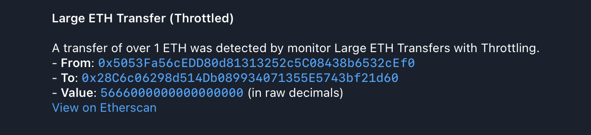

# 5. Monitor with Throttling Policy

This example demonstrates how to configure a notifier with a `throttle` policy
to limit the rate of notifications and prevent alert fatigue.

### Configuration Files

- [`app.yaml`](../../docs/src/user_guide/config_app.md): Basic application configuration.
- [`monitors.yaml`](../../docs/src/user_guide/config_monitors.md): Defines the "Large ETH Transfers with Throttling" monitor.
- [`notifiers.yaml`](../../docs/src/user_guide/config_notifiers.md): Defines a Telegram notifier with a `throttle` policy.

### Monitor Configuration

The `monitors.yaml` file defines a monitor that triggers for any Ethereum
transaction with a value greater than 1 ETH. For a complete reference on monitor configuration, see the [Monitor Configuration documentation](../../docs/src/user_guide/config_monitors.md).

```yaml
monitors:
  - name: 'Large ETH Transfers with Throttling'
    network: 'ethereum'
    filter_script: |
      tx.value > ether(1)
    notifiers:
      - 'Throttled Telegram Notifier'
```

### Notifier Configuration

The `notifiers.yaml` file defines a single Telegram notifier with a `throttle`
policy. For a complete reference on notifier configuration, including policies, see the [Notifier Configuration documentation](../../docs/src/user_guide/config_notifiers.md).

```yaml
notifiers:
  - name: 'Throttled Telegram Notifier'
    telegram:
      token: '<TELEGRAM TOKEN>'
      chat_id: '<TELEGRAM CHAT ID>'
      disable_web_preview: true
      message:
        title: 'Large ETH Transfer (Throttled)'
        body: |
          A transfer of over 1 ETH was detected by monitor {{ monitor_name }}.
          - *From*: `{{ tx.from }}`
          - *To*: `{{ tx.to }}`
          - *Value*: `{{ tx.value | ether }}` ETH
          [View on Etherscan](https://etherscan.io/tx/{{ tx.hash }})
    policy:
      throttle:
        # Send at most 5 notifications every 10 minutes
        max_count: 5
        time_window_secs: 600
```

-   **`policy.throttle`**: For more details on throttling policies, see the [Notifier Configuration documentation](../../docs/src/user_guide/config_notifiers.md#throttle-policy).
    -   `max_count`: The maximum number of notifications to send within the
        time window.
    -   `time_window_secs`: The duration of the time window in seconds.

### How to Run ([Dry-Run Mode](../../docs/src/operations/cli.md#dry-run-mode))

You can test this configuration using the `dry-run` command:

```bash
cargo run --release -- dry-run --from 23159290 --to 23159300 --config-dir examples/5_notifier_with_throttle_policy/
```

Run with `debug` logs:

```bash
RUST_LOG=debug cargo run --release -- dry-run --from 23159290 --to 23159300 --config-dir examples/5_notifier_with_throttle_policy/
```

Replace `23159290` and `23159300` with any Ethereum block numbers to test against.

#### Expected Output

As blocks within the specified range are processed, you should receive only 5
notifications (or another amount specified in notifier config) similar to this:



While the final JSON output should contain all 45 matches:

```json
[
  {
    "monitor_id": 0,
    "monitor_name": "Large ETH Transfers with Throttling",
    "notifier_name": "Throttled Telegram Notifier",
    "block_number": 23159290,
    "transaction_hash": "0x3ab53e8efc91dbace37b6f390208e2dae4f9959415bcff61a92d8fad4fa133cc",
    "type": "transaction",
    "from": "0x841FA51e9DCb53844720cDFdb13286554B4854eD",
    "gas_limit": 21000,
    "hash": "0x3ab53e8efc91dbace37b6f390208e2dae4f9959415bcff61a92d8fad4fa133cc",
    "input": "0x",
    "max_fee_per_gas": "181210806",
    "max_priority_fee_per_gas": "181210806",
    "nonce": 1,
    "to": "0xa51a5FA9A309942f67Ad0872d8860A468EB91851",
    "transaction_index": 103,
    "value": "1197082720736539353"
  },
  // 44 more items
]
```

### How to Run (Default Mode)

Once you have verified your monitor works against historical data in `dry-run`
mode, you can start it in default (live monitoring) mode. In this mode, the
monitor will continuously poll for new blocks and dispatch actual notifications
via the configured notifier when a match is found.

```bash
cargo run --release -- run --config-dir examples/5_notifier_with_throttle_policy/
```
