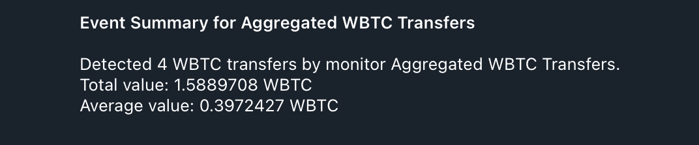

# 6. Notifier with Aggregation Policy

This example demonstrates how to use `aggregation` policy for notifiers as well as `sum` and `avg` filters in templates to aggregate values from multiple monitor matches.

### Configuration Files

- [`app.yaml`](../../docs/src/user_guide/config_app.md): Basic application configuration.
- [`monitors.yaml`](../../docs/src/user_guide/config_monitors.md): Defines the "Aggregated WBTC Transfers" monitor.
- [`notifiers.yaml`](../../docs/src/user_guide/config_notifiers.md): Defines a Telegram notifier that aggregates WBTC transfer values.

### Environment Variables for Notifier Secrets

> **Important:** All secrets and sensitive values in `notifiers.yaml` (such as API tokens, webhook URLs, chat IDs, etc.) must be provided as environment variables.
> For example, if your `notifiers.yaml` contains:
>
> ```yaml
> token: "${TELEGRAM_TOKEN}"
> chat_id: "${TELEGRAM_CHAT_ID}"
> ```
>
> You must set these in your shell before running Argus:
>
> ```sh
> export TELEGRAM_TOKEN="your-telegram-token"
> export TELEGRAM_CHAT_ID="your-chat-id"
> ```
>
> See the example `notifiers.yaml` for all required variables for each notifier type.

### Monitor Configuration

The `monitors.yaml` file defines a monitor that triggers for any WBTC `Transfer` event with a value greater than 0.001 WBTC. For a complete reference on monitor configuration, see the [Monitor Configuration documentation](../../docs/src/user_guide/config_monitors.md).

```yaml
monitors:
  - name: 'Aggregated WBTC Transfers'
    network: 'ethereum'
    address: '0x2260FAC5E5542a773Aa44fBCfeDf7C193bc2C599'
    abi: 'wbtc'
    filter_script: |
      log.name == "Transfer" && log.params.value > wbtc(0.001)
    notifiers:
      - 'Telegram Aggregated WBTC Transfers'
```

### Notifier Configuration

The `notifiers.yaml` file defines a Telegram notifier that uses the `sum` and `avg` filters to aggregate the values of the detected WBTC transfers, and an `aggregation` policy to group notifications within a time window. For a complete reference on notifier configuration, including policies and templating, see the [Notifier Configuration documentation](../../docs/src/user_guide/config_notifiers.md) and [Notifier Templating documentation](../../docs/src/user_guide/notifier_templating.md).

```yaml
notifiers:
  - name: "Telegram Aggregated WBTC Transfers"
    telegram:
      token: "<TELEGRAM TOKEN>"
      chat_id: "<TELEGRAM CHAT ID>"
      disable_web_preview: true
      message:
        title: "Aggregated WBTC Transfers"
        body: |
          This template will not be used directly, as we are using an aggregation policy.
    policy:
      # The `aggregation` policy collects all matches that occur within a time
      # window and sends a single, consolidated notification.
      aggregation:
        # The duration of the aggregation window in seconds.
        # All matches for a given monitor within this period will be grouped.
        window_secs: 300 # 5 minutes
        # The template for the aggregated notification.
        # This template has access to a `matches` array, which contains all the
        # `MonitorMatch` objects collected during the window.
        template:
          title: "Event Summary for {{ monitor_name }}"
          # You can iterate over the `matches` or use filters like `length`.
          body: |
            Detected {{ matches | length }} WBTC transfers by monitor {{ monitor_name }}.
            Total value: {{ matches | map(attribute='log.params.value') | sum | wbtc }} WBTC
            Average value: {{ matches | map(attribute='log.params.value') | avg | wbtc }} WBTC
```

-   **`policy.aggregation`**: For more details on aggregation policies, see the [Notifier Configuration documentation](../../docs/src/user_guide/config_notifiers.md#aggregation-policy).
    -   `time_window_secs`: The duration of the time window in seconds during which notifications will be aggregated.

### How to Run ([Dry-Run Mode](../../docs/src/operations/cli.md#dry-run-mode))

To test this monitor against historical blocks, use the `dry-run` command with the `--config-dir` argument pointing to this example's configuration:

```bash
cargo run --release -- dry-run --from 23289380 --to 23289383 --config-dir examples/6_notifier_with_aggregation_policy/
```

Run with `debug` logs:

```bash
RUST_LOG=debug cargo run --release -- dry-run --from 23289380 --to 23289383 --config-dir examples/6_notifier_with_aggregation_policy/
```

Run with Docker image from GHCR:

```bash
docker run --rm \
  --env-file .env \
  -v "$(pwd)/examples/6_notifier_with_aggregation_policy:/app/configs:ro" \
  -v "$(pwd)/abis:/app/abis:ro" \
  ghcr.io/isserge/argus-rs:latest \
  dry-run --from 23289380 --to 23289383 --config-dir /app/configs
```

Replace `23289380` and `23289383` with any Ethereum block numbers to test against.

#### Expected Output

As blocks within the specified range are processed, you should receive notifications on Telegram (or another specified notifier) with aggregated values.



Once processing is complete, you should see the following output in your terminal, which is a JSON array with all detected monitor matches:

```json
[
  {
    "monitor_id": 0,
    "monitor_name": "Aggregated WBTC Transfers",
    "notifier_name": "Telegram Aggregated WBTC Transfers",
    "block_number": 23289380,
    "transaction_hash": "0x1a702cba6f4d41833facfea9315ad125f8716ea0a44ba4dd5795852438104953",
    "tx": {
      "from": "0x82C74A84520DC27771E8BEF42EAcD43087b13c9A",
      "gas_limit": 272227,
      "hash": "0x1a702cba6f4d41833facfea9315ad125f8716ea0a44ba4dd5795852438104953",
      "input": "0x51337d4400000000000000000000000000000000000000000000000000000000000000000000000000000000000000003c0441b42195f4ad6aa9a0978e06096ea616cda70000000000000000000000002260fac5e5542a773aa44fbcfedf7c193bc2c59900000000000000000000000000000000000000000000000000000000022e6d58000000000000000000000000cbb7c0000ab88b473b1f5afd9ef808440eed33bf00000000000000000000000000000000000000000000000000000000022e5d2d0000000000000000000000000000000000000000000000000000000000000001",
      "max_fee_per_gas": "648840937",
      "max_priority_fee_per_gas": "648840937",
      "nonce": 18507,
      "to": "0xBa47cbFdD61029833841fcaA2ec2591dDfa87e51",
      "transaction_index": 130,
      "value": "0"
    },
    "log": {
      "address": "0x2260fac5e5542a773aa44fbcfedf7c193bc2c599",
      "log_index": 427,
      "name": "Transfer",
      "params": {
        "from": "0x51C72848c68a965f66FA7a88855F9f7784502a7F",
        "to": "0x52Aa899454998Be5b000Ad077a46Bbe360F4e497",
        "value": 36597080
      }
    }
  },
  // 3 more items
]
```

### How to Run (Default Mode)

Once you have verified your monitor works against historical data in `dry-run` mode, you can start it in default (live monitoring) mode. In this mode, the monitor will continuously poll for new blocks and dispatch actual notifications via the configured notifier when a match is found.

```bash
cargo run --release -- run --config-dir examples/6_notifier_with_aggregation_policy/
```

Using Docker image from GHCR:

```bash
# First, create a data directory for this example
mkdir -p examples/6_notifier_with_aggregation_policy/data

# Run the container in detached mode
docker run --rm -d \
  --name argus_example_6 \
  --env-file .env \
  -v "$(pwd)/examples/6_notifier_with_aggregation_policy:/app/configs:ro" \
  -v "$(pwd)/abis:/app/abis:ro" \
  -v "$(pwd)/examples/6_notifier_with_aggregation_policy/data:/app/data" \
  ghcr.io/isserge/argus-rs:latest \
  run --config-dir /app/configs
```
