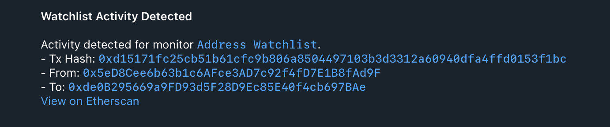

# 7. Address Watchlist Monitor

This example demonstrates a powerful Rhai script feature: using an array as a watchlist to monitor for any activity involving a specific set of addresses, in this case we're using Ethereum Foundation addresses.

### Configuration Files

- [`app.yaml`](../../docs/src/user_guide/config_app.md): Basic application configuration, pointing to public RPC endpoints.
- [`monitors.yaml`](../../docs/src/user_guide/config_monitors.md): Defines the "Large ETH Transfers" monitor.
- [`notifiers.yaml`](../../docs/src/user_guide/config_notifiers.md): Defines "Telegram Large ETH Transfers" notifier.

### Environment Variables for Notifier Secrets

> **Important:** All secrets and sensitive values in `notifiers.yaml` (such as API tokens, webhook URLs, chat IDs, etc.) must be provided as environment variables.
> For example, if your `notifiers.yaml` contains:
>
> ```yaml
> token: "${TELEGRAM_TOKEN}"
> chat_id: "${TELEGRAM_CHAT_ID}"
> ```
>
> You must set these in your shell before running Argus:
>
> ```sh
> export TELEGRAM_TOKEN="your-telegram-token"
> export TELEGRAM_CHAT_ID="your-chat-id"
> ```
>
> See the example `notifiers.yaml` for all required variables for each notifier type.

### Monitor Configuration

The `monitors.yaml` file defines a monitor that triggers for any transaction where the `from` or `to` address is in the predefined `watchlist`.

```yaml
monitors:
  - name: "Address Watchlist"
    network: "ethereum"
    filter_script: |
      let watchlist = [
          "0x5eD8Cee6b63b1c6AFce3AD7c92f4fD7E1B8fAd9F", // EF1
          "0xc06145782F31030dB1C40B203bE6B0fD53410B6d", // EF2
          "0x9fC3dc011b461664c835F2527fffb1169b3C213e", // EF: DeFi Multisig
          "0xde0B295669a9FD93d5F28D9Ec85E40f4cb697BAe"  // EthDev
      ];

      tx.from in watchlist || tx.to in watchlist
    notifiers:
      - "Telegram Watchlist"
```

- **`filter_script`**: This [Rhai script](../../docs/src/user_guide/rhai_scripts.md) showcases two key features:
    - **`let watchlist = [...]`**: Declares an array of addresses to monitor.
    - **`tx.from in watchlist`**: Uses the `in` operator to check if the transaction's sender or recipient is present in the `watchlist` array.

### How to Run ([Dry-Run Mode](../../docs/src/operations/cli.md#dry-run-mode))

To test this monitor against historical blocks, use the `dry-run` command with the `--config-dir` argument pointing to this example's configuration:

```bash
cargo run --release -- dry-run --from 22895951 --to 22895991 --config-dir examples/7_address_watchlist_monitor/
```

Run with Docker image from GHCR:

```bash
docker run --rm \
  --env-file .env \
  -v "$(pwd)/examples/7_address_watchlist_monitor:/app/configs:ro" \
  -v "$(pwd)/abis:/app/abis:ro" \
  ghcr.io/isserge/argus-rs:latest \
  dry-run --from 22895951 --to 22895991 --config-dir /app/configs
```

Replace `22895951` and `22895991` with any Ethereum block numbers to test against.

#### Expected Output

As blocks within the specified range are processed, you should receive notifications on Telegram (or another specified notifier) with aggregated values.



Once processing is complete, you should see the following output in your terminal, which is a JSON array with all detected monitor matches:

```json
[
  {
    "monitor_id": 0,
    "monitor_name": "Address Watchlist",
    "notifier_name": "Telegram Watchlist",
    "block_number": 22895951,
    "transaction_hash": "0xe46fd6d66323ccf136a7785bd9c7cf2768f45cc36f72acbafa0e915093087c0a",
    "tx": {
      "from": "0xa0988fAfe56F4e103C8A592257c1af3F17890597",
      "gas_limit": 81777,
      "hash": "0xe46fd6d66323ccf136a7785bd9c7cf2768f45cc36f72acbafa0e915093087c0a",
      "input": "0x6a761202000000000000000000000000353657acd92f4c83a9dba7cdab84289efffa4feb00000000000000000000000000000000000000000000021e19e0c9bab24000000000000000000000000000000000000000000000000000000000000000000140000000000000000000000000000000000000000000000000000000000000000000000000000000000000000000000000000000000000000000000000000000000000000000000000000000000000000000000000000000000000000000000000000000000000000000000000000000000000000000000000000000000000000000000000000000000000000000000000000000000000000000000000000000000000000000000000000000000000000000000000000000000000000000000000000000000000000000000000000000000000000000000000000000000000016000000000000000000000000000000000000000000000000000000000000000000000000000000000000000000000000000000000000000000000000000000104fccecd6007372618ee82afec57e0c42203173acd10f872c57f0dd6738a6f59512cae7196177e7b62bbce0767f0f9399d6dd2fe93740a2b065494e3edc2a227e21cc529bbc03fd66b2101521659d5eb9131f5e29d9d770026fabc641b2c441ab99f3767dd5deb07cde7f2c81f4cb922feec669237d9636cbf7143e8b8abe9be8ecf1cfc2c09bce3dca54181258c0d33f1bb90c0891e61b9e9251b69a19195909b1e7b2d1dc7e86a0c6f6e9c328e9cf7c37e1407a823dd7f0d63eb80cf14122f73d9401b804463acc29b3820d98e7c9a37676d6a212ad0d9e2418ba703071c1b2de10b245072591c7e63e82cb2de7cca56d734f5640cb5d3fb191c60e35c9cce8453eb721b00000000000000000000000000000000000000000000000000000000",
      "max_fee_per_gas": "4026485592",
      "max_priority_fee_per_gas": "500000000",
      "nonce": 2,
      "to": "0xc06145782F31030dB1C40B203bE6B0fD53410B6d",
      "transaction_index": 246,
      "value": "0"
    }
  },
  {
    "monitor_id": 0,
    "monitor_name": "Address Watchlist",
    "notifier_name": "Telegram Watchlist",
    "block_number": 22895991,
    "transaction_hash": "0xd15171fc25cb51b61cfc9b806a8504497103b3d3312a60940dfa4ffd0153f1bc",
    "tx": {
      "from": "0x5eD8Cee6b63b1c6AFce3AD7c92f4fD7E1B8fAd9F",
      "gas_limit": 84161,
      "hash": "0xd15171fc25cb51b61cfc9b806a8504497103b3d3312a60940dfa4ffd0153f1bc",
      "input": "0xb61d27f6000000000000000000000000c06145782f31030db1c40b203be6b0fd53410b6d00000000000000000000000000000000000000000000003635c9adc5dea0000000000000000000000000000000000000000000000000000000000000000000600000000000000000000000000000000000000000000000000000000000000000",
      "max_fee_per_gas": "7400000000",
      "max_priority_fee_per_gas": "2000000000",
      "nonce": 890,
      "to": "0xde0B295669a9FD93d5F28D9Ec85E40f4cb697BAe",
      "transaction_index": 74,
      "value": "0"
    }
  }
]
```

### How to Run (Default Mode)

Once you have verified your monitor works against historical data in `dry-run` mode, you can start it in default (live monitoring) mode. In this mode, the monitor will continuously poll for new blocks and dispatch actual notifications via the configured notifier when a match is found.

```bash
cargo run --release -- run --config-dir examples/7_address_watchlist_monitor/
```

Using Docker image from GHCR:

```bash
# First, create a data directory for this example
mkdir -p examples/7_address_watchlist_monitor/data

# Run the container in detached mode
docker run --rm -d \
  --name argus_example_7 \
  --env-file .env \
  -v "$(pwd)/examples/7_address_watchlist_monitor:/app/configs:ro" \
  -v "$(pwd)/abis:/app/abis:ro" \
  -v "$(pwd)/examples/7_address_watchlist_monitor/data:/app/data" \
  ghcr.io/isserge/argus-rs:latest \
  run --config-dir /app/configs
```
