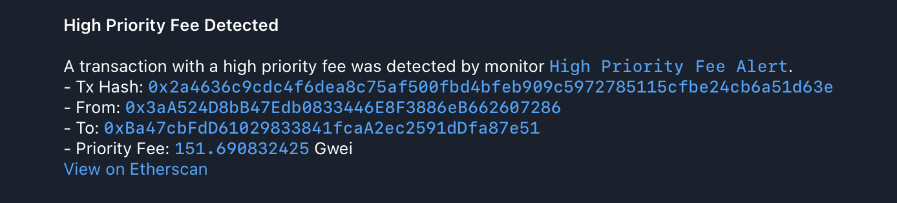

# 8. High Priority Fee

This example demonstrates how to monitor for transactions with unusually high priority fees, which can be an indicator of MEV (Maximal Extractable Value) activity, front-running, or other urgent on-chain actions.

### Configuration Files

- [`app.yaml`](../../docs/src/user_guide/config_app.md): Basic application configuration, pointing to public RPC endpoints.
- [`monitors.yaml`](../../docs/src/user_guide/config_monitors.md): Defines the "Large ETH Transfers" monitor.
- [`notifiers.yaml`](../../docs/src/user_guide/config_notifiers.md): Defines "Telegram Large ETH Transfers" notifier.

### Environment Variables for Notifier Secrets

> **Important:** All secrets and sensitive values in `notifiers.yaml` (such as API tokens, webhook URLs, chat IDs, etc.) must be provided as environment variables.
> For example, if your `notifiers.yaml` contains:
>
> ```yaml
> token: "${TELEGRAM_TOKEN}"
> chat_id: "${TELEGRAM_CHAT_ID}"
> ```
>
> You must set these in your shell before running Argus:
>
> ```sh
> export TELEGRAM_TOKEN="your-telegram-token"
> export TELEGRAM_CHAT_ID="your-chat-id"
> ```
>
> See the example `notifiers.yaml` for all required variables for each notifier type.

### Monitor Configuration

The `monitors.yaml` file defines a monitor that triggers for any transaction with a `max_priority_fee_per_gas` greater than 100 Gwei.

```yaml
monitors:
  - name: "High Priority Fee Alert"
    network: "ethereum"
    filter_script: |
      // A fee over 150 is highly unusual and indicates a strong desire for priority inclusion.
      let priority_fee_threshold = gwei(150);

      tx.max_priority_fee_per_gas > priority_fee_threshold
    notifiers:
      - "Telegram MEV"
```

- **`filter_script`**: This [Rhai script](../../docs/src/user_guide/rhai_scripts.md) accesses the EIP-1559 fee data from the `tx` object.
    - **`tx.max_priority_fee_per_gas`**: This field contains the "tip" paid to the validator to incentivize transaction inclusion.
    - **`gwei(150)`**: The helper function is used to create a `BigInt` representing 150 Gwei for an accurate comparison.

### How to Run ([Dry-Run Mode](../../docs/src/operations/cli.md#dry-run-mode))

To test this monitor against historical blocks, use the `dry-run` command with the `--config-dir` argument pointing to this example's configuration:

```bash
cargo run --release -- dry-run  --from 23315052 --to 23315052 --config-dir examples/8_high_priority_fee/
```

Run with `debug` logs:

```bash
RUST_LOG=debug cargo run --release -- dry-run --from 23315052 --to 23315052 --config-dir examples/8_high_priority_fee/
```

Replace `23315052` and `23315052` with any Ethereum block numbers to test against.


#### Expected Output

As blocks within the specified range are processed, you should receive notifications on Telegram (or another specified notifier) with aggregated values.



Once processing is complete, you should see the following output in your terminal, which is a JSON array with all detected monitor matches:

```json
[
  {
    "monitor_id": 0,
    "monitor_name": "High Priority Fee Alert",
    "notifier_name": "Telegram MEV",
    "block_number": 23315052,
    "transaction_hash": "0x2a4636c9cdc4f6dea8c75af500fbd4bfeb909c5972785115cfbe24cb6a51d63e",
    "tx": {
      "from": "0x3aA524D8bB47Edb0833446E8F3886eB662607286",
      "gas_limit": 177218,
      "hash": "0x2a4636c9cdc4f6dea8c75af500fbd4bfeb909c5972785115cfbe24cb6a51d63e",
      "input": "0x020bf14f000000000000000000000000000000000000000000000000000000000000000000000000000000000000000072331fcb696b0151904c03584b66dc8365bc63f80000000000000000000000000000000000000000000000049796a842e8b6c00000000000000000000000000000000000000000000000000000000054a964fa1d00000000000000000000000000000000000000000000000000000000000000010000000000000000000000000000000000000000000000000000000068be2f5f",
      "max_fee_per_gas": "151690832425",
      "max_priority_fee_per_gas": "151690832425",
      "nonce": 1445,
      "to": "0xBa47cbFdD61029833841fcaA2ec2591dDfa87e51",
      "transaction_index": 7,
      "value": "0"
    }
  }
]
```


### How to Run (Default Mode)

Once you have verified your monitor works against historical data in `dry-run` mode, you can start it in default (live monitoring) mode. In this mode, the monitor will continuously poll for new blocks and dispatch actual notifications via the configured notifier when a match is found.

```bash
cargo run --release -- run --config-dir examples/8_high_priority_fee/
```
