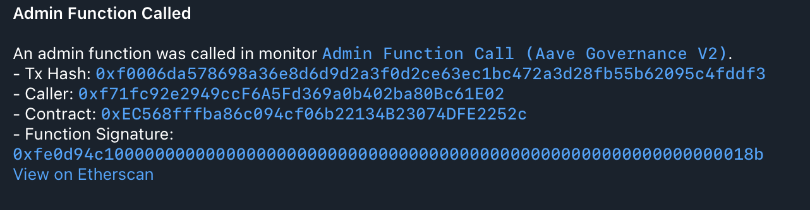

# 9. Admin Function Call Monitor

This example demonstrates how to monitor for calls to a specific function on a contract using Argus's `decode_calldata` feature. This is the recommended approach for monitoring critical or administrative functions, as it is more robust and readable than manually checking function selectors.

This example uses a real-world event: the execution of an Aave governance proposal.

### Monitor Configuration

The `monitors.yaml` file defines a monitor that triggers when it detects a transaction calling the `execute()` function on the Aave Governance V2 contract.

```yaml
monitors:
  - name: "Admin Function Call (Aave Governance V2)"
    network: "ethereum"
    address: "0xEC568fffba86c094cf06b22134B23074DFE2252c"
    abi: "aave_governance_v2"
    filter_script: |
      decoded_call?.name == "execute"
    notifiers:
      - "Telegram Admin"
```

- **`address`**: The specific contract to monitor.
- **`abi`**: The name of the ABI file (without the `.json` extension) located in the `abis/` directory. This is required for decoding.
- **`filter_script`**: This [Rhai script](../../docs/src/user_guide/rhai_scripts.md) inspects the `decoded_call` object.
- **`decoded_call?.name == "execute"`**: This check is performed on the decoded function name. It uses the Elvis notation (`?.`) for safe property access since `decoded_call` might not be available for all transactions

### How to Run ([Dry-Run Mode](../../docs/src/operations/cli.md#dry-run-mode))

To test this monitor against historical blocks, use the `dry-run` command with the `--config-dir` argument pointing to this example's configuration:

```bash
cargo run --release -- dry-run --from 18864956 --to 18864956 --config-dir examples/9_admin_function_call/
```

Run with `debug` logs:

```bash
RUST_LOG=debug cargo run --release -- dry-run --from 18864956 --to 18864956 --config-dir examples/9_admin_function_call/
```

Replace `18864956` with any Ethereum block numbers to test against.


#### Expected Output

As blocks within the specified range are processed, you should receive notifications on Telegram (or another specified notifier) with aggregated values.



Once processing is complete, you should see the following output in your terminal, which is a JSON array with all detected monitor matches:

```json
[
  {
    "monitor_id": 0,
    "monitor_name": "Admin Function Call (Aave Governance V2)",
    "notifier_name": "Telegram Admin",
    "block_number": 18864956,
    "transaction_hash": "0xf0006da578698a36e8d6d9d2a3f0d2ce63ec1bc472a3d28fb55b62095c4fddf3",
    "tx": {
      "from": "0xf71fc92e2949ccF6A5Fd369a0b402ba80Bc61E02",
      "gas_limit": 355494,
      "hash": "0xf0006da578698a36e8d6d9d2a3f0d2ce63ec1bc472a3d28fb55b62095c4fddf3",
      "input": "0xfe0d94c1000000000000000000000000000000000000000000000000000000000000018b",
      "max_fee_per_gas": "21000000000",
      "max_priority_fee_per_gas": "100000000",
      "nonce": 315,
      "to": "0xEC568fffba86c094cf06b22134B23074DFE2252c",
      "transaction_index": 95,
      "value": "0"
    }
  }
]
```


### How to Run (Default Mode)

Once you have verified your monitor works against historical data in `dry-run` mode, you can start it in default (live monitoring) mode. In this mode, the monitor will continuously poll for new blocks and dispatch actual notifications via the configured notifier when a match is found.

```bash
cargo run --release -- run --config-dir examples/9_admin_function_call/
```

